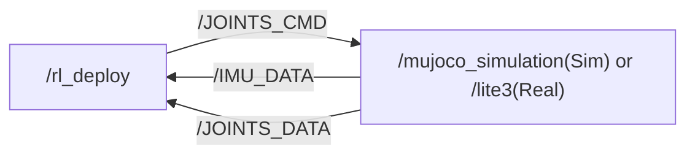
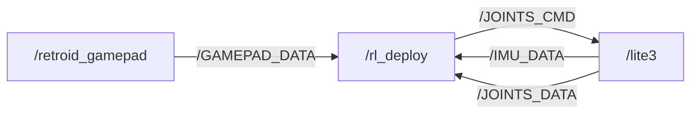
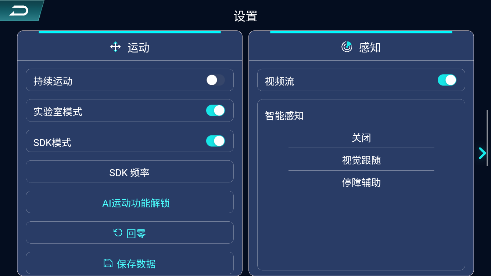
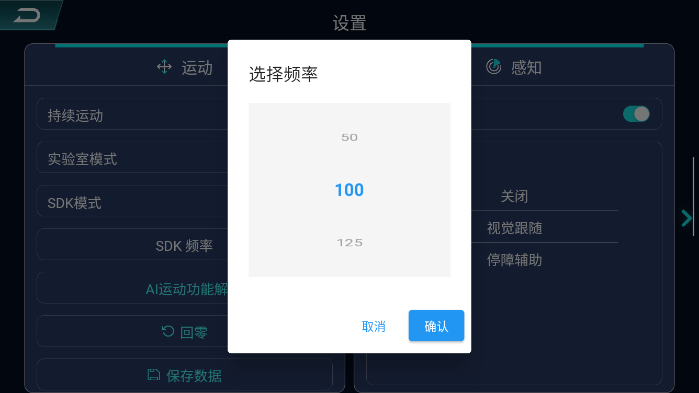

# Lite3 SDK Deploy

[](https://discord.gg/gdM9mQutC8)  

## 1. Note

<span style="color: red;">**SDK deployment is only available for Lite 3 Venture Edition.**</span>  

## 2. Overview

This repository uses ROS2 to implement the entire Sim-to-sim and Sim-to-real workflow. Therefore, ROS2 must first be installed on your computer, such as installing [ROS2 Humble](https://docs.ros.org/en/humble/index.html) on Ubuntu 22.04.
Keyboard controls, the process is as follows:

Gamepad controls (only Sim-to-real), the process is as follows:

The following listings show the low-level ROS 2 communication; control commands are described in the control interfaces section below.

```bash
# ros2 topic list
/BATTERY_DATA(Not yet open)
/IMU_DATA
/JOINTS_CMD
/JOINTS_DATA
/GAMEPAD_DATA
/parameter_events
/rosout

# ros2 node info /rl_deploy 
/rl_deploy
  Subscribers:
    /BATTERY_DATA: drdds/msg/BatteryData
    /IMU_DATA: drdds/msg/ImuData
    /JOINTS_DATA: drdds/msg/JointsData
    /parameter_events: rcl_interfaces/msg/ParameterEvent
  Publishers:
    /JOINTS_CMD: drdds/msg/JointsDataCmd
    /parameter_events: rcl_interfaces/msg/ParameterEvent
    /rosout: rcl_interfaces/msg/Log
  Service Servers:
    /rl_deploy/describe_parameters: rcl_interfaces/srv/DescribeParameters
    /rl_deploy/get_parameter_types: rcl_interfaces/srv/GetParameterTypes
    /rl_deploy/get_parameters: rcl_interfaces/srv/GetParameters
    /rl_deploy/list_parameters: rcl_interfaces/srv/ListParameters
    /rl_deploy/set_parameters: rcl_interfaces/srv/SetParameters
    /rl_deploy/set_parameters_atomically: rcl_interfaces/srv/SetParametersAtomically
  Service Clients:

  Action Servers:

  Action Clients:

# Run mujoco node in simulation
# ros2 node info /mujoco_simulation 
/mujoco_simulation
  Subscribers:
    /JOINTS_CMD: drdds/msg/JointsDataCmd
  Publishers:
    /IMU_DATA: drdds/msg/ImuData
    /JOINTS_DATA: drdds/msg/JointsData
    /parameter_events: rcl_interfaces/msg/ParameterEvent
    /rosout: rcl_interfaces/msg/Log
  Service Servers:
    /mujoco_simulation/describe_parameters: rcl_interfaces/srv/DescribeParameters
    /mujoco_simulation/get_parameter_types: rcl_interfaces/srv/GetParameterTypes
    /mujoco_simulation/get_parameters: rcl_interfaces/srv/GetParameters
    /mujoco_simulation/list_parameters: rcl_interfaces/srv/ListParameters
    /mujoco_simulation/set_parameters: rcl_interfaces/srv/SetParameters
    /mujoco_simulation/set_parameters_atomically: rcl_interfaces/srv/SetParametersAtomically
  Service Clients:

  Action Servers:

  Action Clients:
```

## 3. Contribution

Everyone is welcome to contribute to this repo. If you discover a bug or optimize our training config, just submit a pull request and we will look into it.

## 4. Sim-to-sim

```bash
sudo apt-get update
sudo apt-get install libevdev-dev
pip install "numpy < 2.0" mujoco scipy
git clone https://github.com/DeepRoboticsLab/sdk_deploy.git

# Compile
cd sdk_deploy
source /opt/ros/<ros-distro>/setup.bash
colcon build --packages-up-to lite3_sdk_deploy --cmake-args -DBUILD_PLATFORM=x86
```

Start the simulator in Terminal 2 before starting the controller in Terminal 1.
For simultaneous robots, use separate DDS domains for all their joint and IMU topics.

```bash
# Run (Open 2 terminals)
# Terminal 1 
export ROS_DOMAIN_ID=1
source install/setup.bash
ros2 run lite3_sdk_deploy rl_deploy

# Terminal 2
export ROS_DOMAIN_ID=1
source install/setup.bash
python3 src/Lite3_sdk_deploy/interface/robot/simulation/mujoco_simulation_ros2.py
```

### 4.1. Control

For Sim-to-sim tests, use only the keyboard or ROS 2 interface. Refer to [Control interfaces](#6-control-interfaces) for selection instructions and commands.

<span style="color: red;">**Note:**</span>
> - Right click simulator window and select "always on top"
> - When the robot dog stands up, it may become stuck due to self-collision in the simulation. This is not a bug; please try again.

## 5. Sim-to-real

Before proceeding with this step, verify **the version of your Lite3 system image**. Ensure the image has **ROS 2** and the **sdk_service functionality package** installed. If the image has not been upgraded, please contact your technical support.
The default controller input is currently `RemoteCommandType::kRos2`; see the control interfaces section below.


For keyboard control, select `RemoteCommandType::kKeyBoard` in `main.cpp`, rebuild, and restart the SDK. Please use this app for the following process!

You can download the structure parts mentioned in the video which is used to mount the AGX Jetson Orin on the robot with this [link](https://drive.google.com/file/d/1ksdvI1zkGVMrUQH-tLnD6jNTp4dic-UI/view?usp=drive_link).

### 5.1. SDK Mode Activation and Switching

<span style="color: red;">**Warning: Ensure Lite3 switches modes while in a safe state such as idle; failure to do so may result in machine damage or personal injury.**</span>  
<span style="color: red;">**Warning: Switching states requires processing time. After pressing the slider, please wait for approximately 10 seconds. Then manually rotate the joint to ensure it moves freely without resistance and is not in damping mode. Only then proceed with standing up or walking. Failure to do so may cause dangerous situations such as the Lite3 suddenly jumping up or dashing forward.**</span>
> - Click the slider to the right of SDK Mode. When the slider turns blue, it indicates that SDK Mode is enabled. Lite3 will automatically perform a zero-reset. On the contrary，SDK mode will become inactive, and the system will switch to MPC mode.  



### 5.2. SSH connection

```bash
# computer and gamepad should both connect to WiFi
# WiFi: YSC-JYML-xxxxxx
# Passward: 12345678 (If wrong, contact technical support)

# ssh connect for remote development
#Username	Password
#ysc		' (a single quote)
ssh ysc@192.168.2.1
# enter your passward, the terminal will be active on the Lite3 computer
```

### 5.3. SDK Deployment

#### 5.3.1. Compile ROS2 package

```bash
# scp to transfer files to Lite3 (open a terminal on your local computer)
ssh ysc@192.168.2.1 'mkdir -p ~/Lite3_sdk_deploy/src'
scp -r ~/sdk_deploy/src/drdds ~/sdk_deploy/src/Lite3_sdk_deploy ysc@192.168.2.1:~/Lite3_sdk_deploy/src

# ssh connect for remote development
ssh ysc@192.168.2.1
cd Lite3_sdk_deploy
source /opt/ros/foxy/setup.bash
# Build the updated drdds messages and SDK into this workspace.
colcon build --packages-up-to lite3_sdk_deploy --cmake-args -DBUILD_PLATFORM=arm 
```

#### 5.3.2. Run sdk deploy

```bash
# run rl_deploy control
cd Lite3_sdk_deploy
source install/setup.bash
ros2 run lite3_sdk_deploy rl_deploy
```

### 5.4. (Optional) Change topic frequency

> - You can use the App on the Retroid gamepad to adjust the publishing frequency of /JOINTS_DATA and /IMU_DATA.  
 

### 5.5. (Optional) Cross-host communication

The Lite3 computer has limited resources. To expand other functionalities, you may additionally configure a host computer (such as NVIDIA Jetson) for ROS2 communication.

1. Connect the host to Lite3 via a wired Ethernet cable.
2. Following the steps above, run rl_deploy on the host computer.
When compiling rl_deploy on the host computer, you may encounter the following error:
```bash
/opt/rh/gcc-toolset-14/root/usr/include/c++/14/bits/stl_vector.h:1130: std::vector<_Tp, _Alloc>::reference std::vector<_Tp, _Alloc>::operator[](size_type) [with _Tp = unsigned int; _Alloc = std::allocator<unsigned int>; reference = unsigned int&; size_type = long unsigned int]: Assertion '__n < this->size()' failed.
```
This is caused by an incompatible version of the ONNX Runtime library within the third_party directory of rl_deploy. Please select the appropriate ONNX Runtime library version based on your host architecture. Download the folder and replace src/Lite3_sdk_deploy/third_party/onnxruntime/arm with the folder you downloaded.
Verified cross-host cases:

1. NVIDIA Jetson AGX Orin with Jetpack version 6.1 and CUDA version 12.6. using the `onnxruntime-linux-aarch64-gpu-cuda12-1.18.1.tar.bz2` version from [csukuangfj/onnxruntime-libs](https://github.com/csukuangfj/onnxruntime-libs/releases?page=2).
2. Lite3 Venture original onboard compute. Use this [link](https://drive.google.com/drive/folders/1ZJEQf7VxLLKFZHxS3WUhEhj227QD7ln3?usp=drive_link) the download arm folder.

<span style="color: red;">**Warning: The ROS 2 version in Lite3 is foxy (Compatible with Ubuntu 20.04). If the ROS 2 version in your host computer is not foxy, communication will not work properly (ROS 2 does not officially support cross-version communication).**</span> 
We add an additional shadow subscriber to solve this problem temporarily.
If you know how to solve it better, welcome to submit an issue or a pull request.

### 5.6. Troubleshooting startup

The `drdds` warning that `BUILD_PLATFORM` was not used is harmless: that option
selects the SDK platform, while `drdds` only generates ROS messages.

If startup throws `std::bad_alloc`, a debugger trace through
`rmw_dds_common::msg::typesupport_fastrtps_cpp::cdr_deserialize` can indicate
incompatible ROS 2 discovery traffic on the network. This is a
[known ROS 2 discovery issue](https://github.com/ros2/rmw_fastrtps/issues/733).
Stop the incompatible participants or separate their DDS domains from the robot.
The standard onboard SDK service uses domain `0`, which is also the default
in a clean shell; no manual export is required. Domain `1` in the Sim-to-sim
example is for simulation. Keep the real-robot controller and SDK service on
the same domain. Reinstalling the packages does not remove incompatible
network traffic.

`No valid joint/IMU data received within 10 seconds` is a separate startup check:
enable SDK mode as described above and check that `lite3_transfer` is running
and publishing `/JOINTS_DATA` and `/IMU_DATA` on the SDK's domain.

## 6. Control interfaces

Use the build and deployment steps above before selecting an input method; the
current selection in `main.cpp` is `kRos2`.

### 6.1. Keyboard

To use keyboard control, set `RemoteCommandType::kKeyBoard` (`0`) in [main.cpp](main.cpp), rebuild, and restart the SDK.

Press the following keys in the terminal running `rl_deploy`:

> - z： default position / stand up from lie down
> - c： rl control default position
> - x： lie down
> - r： joint damping
> - wasd：forward/leftward/backward/rightward
> - qe：counter clockwise/clockwise

### 6.2. Gamepad

To use gamepad control, set `RemoteCommandType::kRetroidGamepad` (`1`) in [main.cpp](main.cpp), rebuild, and restart the SDK.

> - Y： default position / stand up from lie down
> - A： rl control default position
> - X： lie down
> - Press both joystick buttons：joint damping
> - Left joystick：forward/leftward/backward/rightward
> - Right joystick：clockwise/counter clockwise

### 6.3. ROS 2

To use ROS 2 control, set `RemoteCommandType::kRos2` (`2`) in [main.cpp](main.cpp), rebuild, and restart the SDK.

Start the controller with `ros2 run lite3_sdk_deploy rl_deploy`; in another
terminal, source the same ROS/workspace environment and use the same DDS domain.
For the Sim-to-sim setup above, run `export ROS_DOMAIN_ID=1` in this command terminal too.

**Stand up:**

```bash
ros2 topic pub --once /rl_deploy/command_state std_msgs/msg/String '{data: stand}'
```

**Enter policy control after standing has finished:**

```bash
ros2 topic pub --once /rl_deploy/command_state std_msgs/msg/String '{data: rl_control}'
```

**Simulation movement example (forward at a requested 0.1 m/s):**

```bash
ros2 topic pub --rate 50 /rl_deploy/cmd_vel geometry_msgs/msg/Twist \
  '{linear: {x: 0.1, y: 0.0}, angular: {z: 0.0}}'
```

Use `linear.x` for forward/backward (m/s), `linear.y` for left/right (m/s), and
`angular.z` for counterclockwise/clockwise yaw (rad/s); other axes must be zero.
Nonzero velocity is used only in policy control. Press Ctrl+C to stop publishing;
after 0.25 seconds without velocity input, the effective command becomes zero.

**Lie down:**

```bash
ros2 topic pub --once /rl_deploy/command_state std_msgs/msg/String '{data: lie_down}'
```

**Request joint damping:**

```bash
ros2 topic pub --once /rl_deploy/command_state std_msgs/msg/String '{data: damping}'
```

**Read current state, commands, joint data, and base orientation/angular velocity:**

```bash
ros2 topic echo /rl_deploy/status
# In a separate terminal, check the effective command rate:
ros2 topic hz /rl_deploy/effective_cmd_vel
```

`/rl_deploy/status` publishes [drdds/msg/RobotStatus](../drdds/msg/RobotStatus.msg)
at 10 Hz; effective commands are published at 50 Hz. Default velocity limits are
0.7 m/s forward, 0.5 m/s sideways, and 0.7 rad/s yaw. For posture-only operation,
start the controller with all three limits at zero:

```bash
ros2 run lite3_sdk_deploy rl_deploy --ros-args \
  -p max_forward_velocity:=0.0 -p max_side_velocity:=0.0 -p max_yaw_velocity:=0.0
```

Simulation command and stand/lie checks passed, but small backward/sideways
commands produce weak motion with the existing policy.

The hardware check after a clean Foxy reinstall passed stand, a 0.1 m/s forward
request for 1.5 seconds in policy control, and lie down, with measured joint
responses and no safety activation. Status/effective commands ran at 10/50 Hz,
and velocity input expired after 0.232 seconds. Actual forward speed and travel
distance were not measured. The test ended in `lie_down`; zero requested
velocity does not guarantee zero physical drift.
