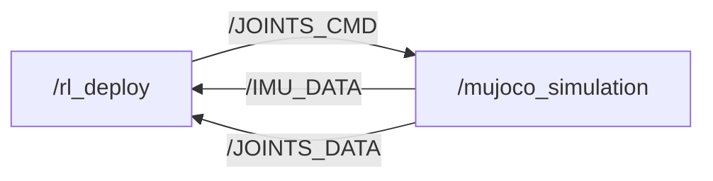

# M20S SDK Deploy

[](https://discord.gg/gdM9mQutC8)

## 1. Overview

This repository uses ROS2 to implement the entire Sim-to-sim and Sim-to-real workflow for the **M20S** robot. ROS2 must first be installed on your computer, such as installing [ROS2 Humble](https://docs.ros.org/en/humble/index.html) on Ubuntu 22.04.



The following listings show the low-level ROS 2 communication; control commands are described in the control interfaces section below.

```bash
# ros2 topic list
/BATTERY_DATA
/IMU_DATA
/JOINTS_CMD
/JOINTS_DATA
/parameter_events
/rosout

# ros2 node info /mujoco_simulation
/mujoco_simulation
  Subscribers:
    /JOINTS_CMD: drdds/msg/JointsDataCmd
  Publishers:
    /IMU_DATA: drdds/msg/ImuData
    /JOINTS_DATA: drdds/msg/JointsData
    /parameter_events: rcl_interfaces/msg/ParameterEvent
    /rosout: rcl_interfaces/msg/Log

# ros2 node info /rl_deploy
/rl_deploy
  Subscribers:
    /BATTERY_DATA: drdds/msg/BatteryData
    /IMU_DATA: drdds/msg/ImuData
    /JOINTS_DATA: drdds/msg/JointsData
    /parameter_events: rcl_interfaces/msg/ParameterEvent
  Publishers:
    /JOINTS_CMD: drdds/msg/JointsDataCmd
    /parameter_events: rcl_interfaces/msg/ParameterEvent
    /rosout: rcl_interfaces/msg/Log
```

## 2. Contribution

Everyone is welcome to contribute to this repo. If you discover a bug or optimize our training config, just submit a pull request and we will look into it.

## 3. Sim-to-sim

```bash
pip install "numpy < 2.0" mujoco scipy
git clone https://github.com/DeepRoboticsLab/sdk_deploy.git

# Compile
cd sdk_deploy
source /opt/ros/<ros-distro>/setup.bash
colcon build --packages-up-to m20s_sdk_deploy --cmake-args -DBUILD_PLATFORM=x86
```

Start the simulator in Terminal 2 before starting the controller in Terminal 1.
For simultaneous robots, use separate DDS domains for all their joint and IMU topics.

```bash
# Run (Open 2 terminals)
# Terminal 1
export ROS_DOMAIN_ID=1
source install/setup.bash
ros2 run m20s_sdk_deploy rl_deploy

# Terminal 2
export ROS_DOMAIN_ID=1
source install/setup.bash
python3 src/M20S_sdk_deploy/interface/robot/simulation/mujoco_simulation_ros2.py
```

### 3.1. Control

For Sim-to-sim tests, use only the keyboard or ROS 2 interface. Refer to [Control interfaces](#5-control-interfaces) for selection instructions and commands.

<span style="color: red;">**Note:**</span>
> - Right click simulator window and select "always on top"
> - When the robot dog stands up, it may become stuck due to self-collision in the simulation. This is not a bug; please try again.

## 4. Sim-to-Real

This process is almost identical to simulation-simulation. You only need to add the step of connecting to Wi-Fi to transfer data, and then modify the compilation instructions. Real-robot control supports keyboard and gamepad input. Select the desired `RemoteCommandType` in `main.cpp` and rebuild; the default is `kKeyBoard`.

**Please first use the OTA upgrade function in the handle settings to upgrade the hardware to version 1.1.8. We require a SDK authentication code to activate the SDK mode. Please contact our technical support team to get this unique code for each robot.**

```bash
# computer and gamepad should both connect to WiFi
# WiFi: CA9C********
# Password: 12345678 (If wrong, contact technical support)
# Note: If you are connected via the second WiFi, use 10.21.41.1 instead of 10.21.33.103
#       for ssh/scp below. It is the same robot, only the IP differs per WiFi network.

# scp to transfer files to M20S (open a terminal on your local computer)
# Include the updated drdds source to generate RobotStatus in the workspace.
ssh user@10.21.33.103 'mkdir -p ~/M20S_SDK/src'
scp -r ~/sdk_deploy/src/drdds ~/sdk_deploy/src/M20S_sdk_deploy user@10.21.33.103:~/M20S_SDK/src/

# ssh connect for remote development
ssh user@10.21.33.103
cd ~/M20S_SDK
source /opt/ros/foxy/setup.bash # source ROS2 env
# Build drdds and the SDK into this workspace; keep the firmware installation
# under /opt/ros/foxy unchanged. Source this workspace when running the new SDK.
colcon build --packages-up-to m20s_sdk_deploy --cmake-args -DBUILD_PLATFORM=arm

sudo su # Root
source /opt/ros/foxy/setup.bash # source ROS2 env
source /opt/robot/scripts/setup_ros2.sh
# Use the gamepad to enable SDK mode. Need authorization code, please contact technical support team.

# Run
source install/setup.bash
ros2 run m20s_sdk_deploy rl_deploy

# exit sdk mode:
# Use the gamepad to enable SDK mode.
```

## 5. Control interfaces

Use the build and deployment steps above before selecting an input method; the
default selection in `main.cpp` is `kKeyBoard`.

### 5.1. Keyboard

To use keyboard control, set `RemoteCommandType::kKeyBoard` (`0`) in [main.cpp](main.cpp), rebuild, and restart the SDK.

Press the following keys in the terminal running `rl_deploy`:

- z： default position
- c： rl control default position
- x： lie down
- wasd：forward/leftward/backward/rightward
- qe：counter clockwise/clockwise

### 5.2. Gamepad

To use gamepad control, set `RemoteCommandType::kGamepad` (`1`) in [main.cpp](main.cpp), rebuild, and restart the SDK.

*(Note: When using the gamepad control function, please ensure that the Gamepad APP version is V1.5.11 or higher.)*

- L1： default position
- L2： rl control default position
- R1： lie down
- R2： joint damping
- Left joystick：forward/leftward/backward/rightward
- Right joystick：clockwise/counter clockwise

