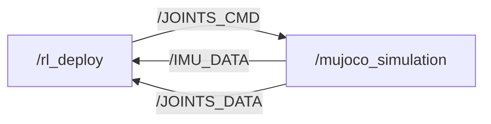

# S10 SDK Deploy

[](https://discord.gg/gdM9mQutC8)

## 1. Overview

This repository provides the ROS 2 and MuJoCo simulation environment for the S10 quadruped-wheeled robot.

The default MuJoCo scene is `S10.xml`, which includes the unscaled S10 robot model.



## 2. Setup

### 2.1. Prerequisites

Use Ubuntu 22.04 with ROS 2 Humble.

### 2.2. Clone the Repository and Install Dependencies

```bash
pip install "numpy < 2.0" mujoco scipy
```

### 2.3. Build for Sim-to-Sim

Source ROS and build with the `x86` platform flag:

```bash
source /opt/ros/humble/setup.bash
colcon build --packages-up-to s10_sdk_deploy --cmake-args -DBUILD_PLATFORM=x86
```

For sim-to-real deployment, use the `arm` build described in Section 4.

## 3. Sim-to-Sim

The simulation workflow requires two terminals with the same `ROS_DOMAIN_ID`.

### 3.1. Start the Deployment Node

In Terminal 1, run:

```bash
export ROS_DOMAIN_ID=1
source install/setup.bash
ros2 run s10_sdk_deploy rl_deploy
```

### 3.2. Start the MuJoCo Simulator

In Terminal 2, run:

```bash
export ROS_DOMAIN_ID=1
source install/setup.bash
python3 src/S10_sdk_deploy/interface/robot/simulation/mujoco_simulation_ros2.py
```

### 3.3. Keyboard Control

Press the following keys in the terminal running `rl_deploy`:

| Key | Action |
| --- | --- |
| `z` | Stand up (default position) |
| `c` | Enter RL control mode |
| `x` | Lie down |
| `w/a/s/d` | Forward / left / backward / right |
| `q/e` | Rotate counterclockwise / clockwise |

Right-click the simulator window and select "always on top" if it loses focus during testing.

## 4. Sim-to-Real

The deployment code can run directly on the S10. Unlike sim-to-sim, real-robot deployment uses the ARM build target, requires SDK mode to be enabled from the gamepad, and does not require the MuJoCo simulation process.

**Please first use the OTA upgrade function in the handle settings to upgrade the hardware to version 1.1.8. We require an SDK authentication code to activate SDK mode. Please contact our technical support team to get this unique code for each robot.**

### 4.1. Enable SDK Mode

Contact technical support to obtain the authorization code before enabling SDK mode. Then enable SDK mode on the robot using the gamepad.

### 4.2. Transfer and Build

```bash
# Computer and gamepad should both connect to WiFi
# WiFi: S10 ********
# Password: 12345678 (If wrong, contact technical support)

# scp to transfer files to S10 (open a terminal on your local computer)
ssh user@10.21.33.103 'mkdir -p ~/S10_sdk_deploy/src'
scp -r ~/sdk_deploy/src/drdds ~/sdk_deploy/src/S10_sdk_deploy user@10.21.33.103:~/S10_sdk_deploy/src

# ssh connect for remote development
ssh user@10.21.33.103
cd S10_sdk_deploy
source /opt/ros/foxy/setup.bash
colcon build --packages-up-to s10_sdk_deploy --cmake-args -DBUILD_PLATFORM=arm
```

### 4.3. Start the Deployment Node

From the workspace root, run:

```bash
source install/setup.bash
ros2 run s10_sdk_deploy rl_deploy
```

### 4.4. Real-Robot Gamepad Controls

The real-robot deployment supports gamepad control. The gamepad is currently selected in [`main.cpp`](main.cpp) by constructing the state machine with `RemoteCommandType::kGamepad`. To switch the input method, edit the gamepad and keyboard state-machine construction lines in that file, then rebuild the workspace.

| Input | Action |
| --- | --- |
| Button `C` | Enter the stand-up state. |
| Button `A` | Enter the RL control state after the robot is standing. |
| Button `B` | Enter the lie-down state. |
| Button `D` | Enter the joint-damping state. |
| Left joystick | Send forward and lateral velocity commands. |
| Right joystick | Send rotational velocity commands. |
